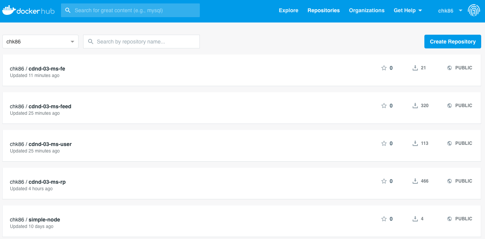
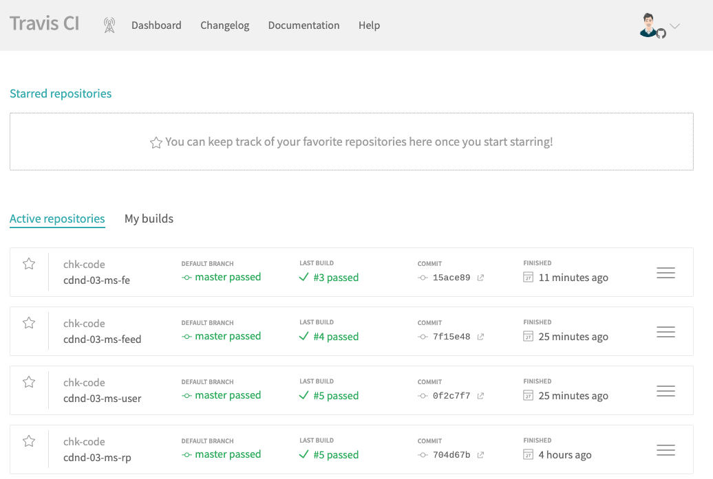
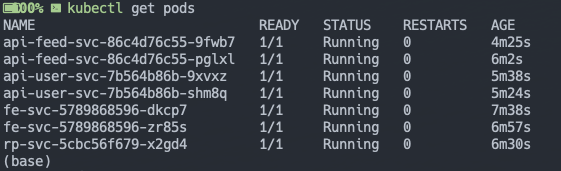
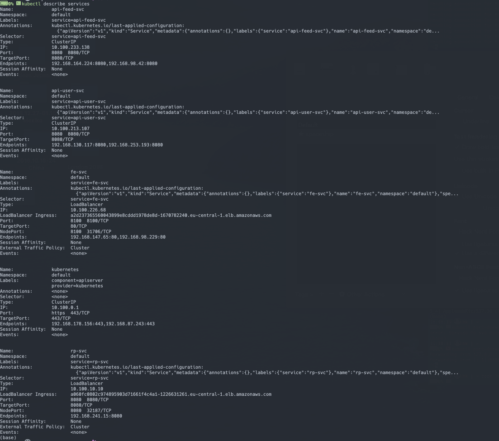
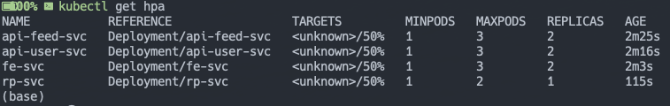
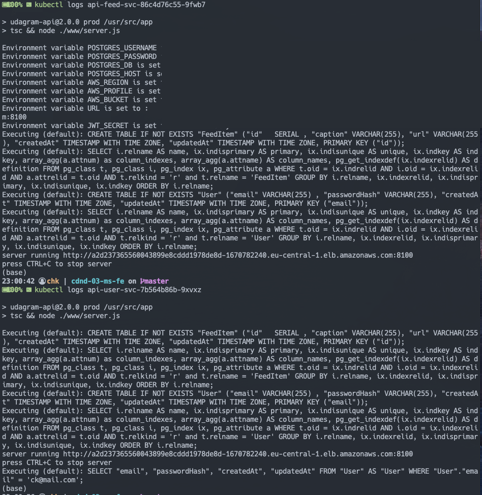
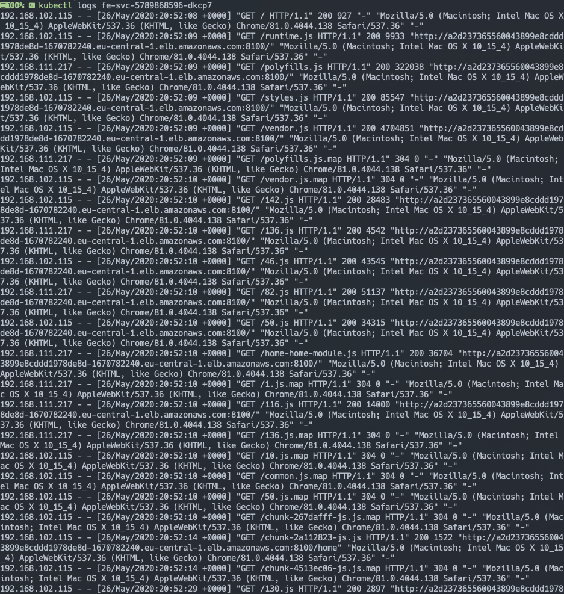

# CDND 03 - Project "Refactor Monolith to Microservices"
Udagram is a simple cloud application developed alongside the Udacity Cloud Engineering Nanodegree. It allows users to register and log into a web client, post photos to the feed, and process photos using an image filtering microservice.

## Monolith: Udagram Image Filtering Application
The project is split into two parts:
1. Frontend - Angular web application built with Ionic Framework
2. Backend RESTful API - Node-Express application

## Key Achievements:

This projects consists of 4 repos:
* :computer: [Frontend](https://github.com/chk-code/cdnd-03-ms-fe)
* :wrench: [BackendFeed](https://github.com/chk-code/cdnd-03-ms-feed)
* :wrench: [BackendUser](https://github.com/chk-code/cdnd-03-ms-user)
* :satellite: [ReverseProxy](https://github.com/chk-code/cdnd-03-ms-rp)

Every repo has its own TravisCI Pipeline.

1. Setup

a) Refactor the API

Decompose the API code to have two separate projects that can be run independent of one another: /users and /feed endpoints.

b) Deploying a Kubernetes Cluster with Amazon EKS [Helpful Link](https://logz.io/blog/amazon-eks-cluster/)

Add VPC at the Console
Add a new cluster over the console:
```bash
aws eks --region eu-central-1 create-cluster --name cdnd03ms --role-arn arn:aws:iam::AWSACCOUNT:role/eks-access-udacity --resources-vpc-config subnetIds=subnet-id1,subnet-id2,subnet-id3,securityGroupIds=sg-id

aws eks --region eu-central-1 update-kubeconfig --name cdnd03ms

curl -O https://amazon-eks.s3-us-west-2.amazonaws.com/cloudformation/2019-01-09/aws-auth-cm.yaml
arn:aws:iam::AWSACCOUNT:role/cdnd03ms-workernodes-NodeInstanceRole-VO8LLABLXEB5
```

2. Containerize the Code

Create Dockerfiles for the frontend and backend applications.



3. Build CICD Pipeline

Set up GitHub account to integrate with Travis CI and generate a build pipeline.



4. Deploy to Kubernetes

Deploy the Docker containers for the API applications and web application as their own pods in AWS EKS.



5. Set up Kubernetes Services

Configure a reverse proxy to direct requests to the appropriate backend and frontend loadbalancer



6. Self Healing HPA

Configure Kubernetes deployments to recover from failure.



7. Log files

Check logfiles for debugging.




# Project Task

## Getting Started
> _tip_: it's recommended that you start with getting the backend API running since the frontend web application depends on the API.

### Prerequisite
1. The depends on the Node Package Manager (NPM). You will need to download and install Node from [https://nodejs.com/en/download](https://nodejs.org/en/download/). This will allow you to be able to run `npm` commands.
2. Environment variables will need to be set. These environment variables include database connection details that should not be hard-coded into the application code.
#### Environment Script
A file named `set_env.sh` has been prepared as an optional tool to help you configure these variables on your local development environment.

We do _not_ want your credentials to be stored in git. After pulling this `starter` project, run the following command to tell git to stop tracking the script in git but keep it stored locally. This way, you can use the script for your convenience and reduce risk of exposing your credentials.
`git rm --cached set_env.sh`

Afterwards, we can prevent the file from being included in your solution by adding the file to our `.gitignore` file.

### Database
Create a PostgreSQL database either locally or on AWS RDS. Set the config values for environment variables prefixed with `POSTGRES_` in `set_env.sh`.

### S3
Create an AWS S3 bucket. Set the config values for environment variables prefixed with `AWS_` in `set_env.sh`.

### Backend API
* To download all the package dependencies, run the command from the directory `udagram-api/`:
    ```bash
    npm install .
    ```
* To run the application locally, run:
    ```bash
    npm run dev
    ```
* You can visit `http://localhost:8080/api/v0/feed` in your web browser to verify that the application is running. You should see a JSON payload. Feel free to play around with Postman to test the API's.

### Frontend App
* To download all the package dependencies, run the command from the directory `udagram-frontend/`:
    ```bash
    npm install .
    ```
* Install Ionic Framework's Command Line tools for us to build and run the application:
    ```bash
    npm install -g ionic
    ```
* Prepare your application by compiling them into static files.
    ```bash
    ionic build
    ```
* Run the application locally using files created from the `ionic build` command.
    ```bash
    ionic serve
    ```
* You can visit `http://localhost:8100` in your web browser to verify that the application is running. You should see a web interface.
